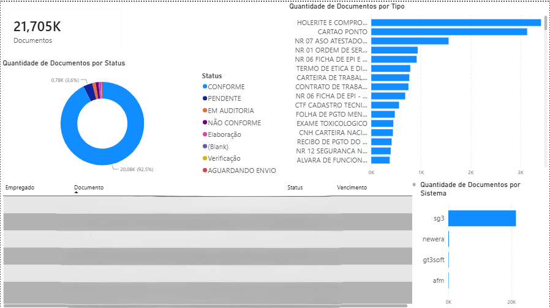

# Third-Party Documents Management Pipeline

## 📌 Project Overview
This project is an automated Data Engineering pipeline designed to extract, clean, and consolidate third-party compliance documents from multiple heterogeneous source systems (SG3, Newera, GT3Soft, and AFM). 

The orchestrator processes disparate Excel files, standardizes schemas, and unifies the data into a highly compressed `.parquet` format, feeding a Power BI dashboard for compliance monitoring and risk management.

## 🏛️ Architecture (Medallion Approach)
The data pipeline follows a strict Medallion Architecture:
* **Bronze Layer (`data/01_bronze/`):** Raw Excel files (`.xls`, `.xlsx`) exported manually from the source systems.
* **Silver Layer (`data/02_silver/`):** Cleaned, standardized, and validated data saved as individual `.parquet` files. Handled by modular parsers leveraging the DRY (Don't Repeat Yourself) principle.
* **Gold Layer (`data/03_gold/`):** A single, consolidated Big Table (`consolidated_documents.parquet`) ready for Business Intelligence consumption.

## 📊 Business Intelligence & Impact
The pipeline feeds a Power BI dashboard that monitors over 21,000 compliance documents, providing stakeholders with a clear view of missing, valid, and expired documentation across all branches and third-party companies.

*(Note: Sensitive data such as employee names and specific CNPJs have been blurred to comply with privacy and data governance policies).*

 
## 🛠️ Tech Stack
* **Language:** Python 3.14
* **Data Processing:** `pandas`, `openpyxl`, `xlrd`
* **Storage Format:** Apache Parquet (`pyarrow` / `fastparquet`)
* **Visualization:** Power BI & DAX

## ⚙️ How to Run Locally

1. **Clone the repository:**
   ```bash
   git clone [https://github.com/your-username/third-party-docs-management.git](https://github.com/your-username/third-party-docs-management.git)

2. **Set up the virtual environment and install dependencies:**
    ```bash
    pip install -r requirements.txt

3. **Run the pipeline: Simply execute the orchestrator to process all files from Bronze to Gold:**

## 📁 Project Structure
```text
third-party-docs-management/
│
├── data/                  # Local storage
│   ├── 01_bronze/         # Raw source files
│   ├── 02_silver/         # Cleaned individual parquets
│   └── 03_gold/           # Consolidated final parquet
│
├── docs/                  
│   └── dashboard_preview_blurred.png
│
├── src/                   
│   └── processing/        
│       ├── orchestrator.py        # Main pipeline runner
│       └── parsers/               
│           ├── afm_parser.py
│           ├── gt3soft_parser.py
│           ├── newera_parser.py
│           ├── sg3_parser.py
│           └── utils.py           # Shared logic and schema enforcement
│
├── .gitignore            
├── requirements.txt       # dependencies
└── README.md
